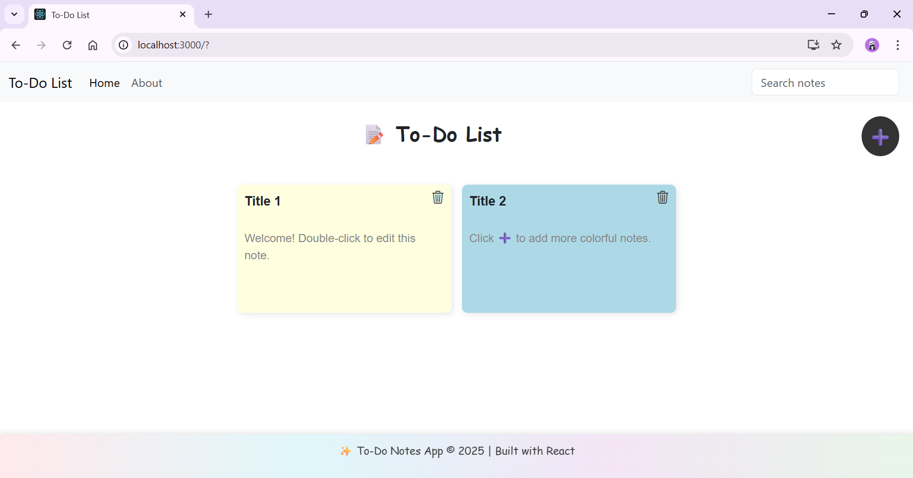
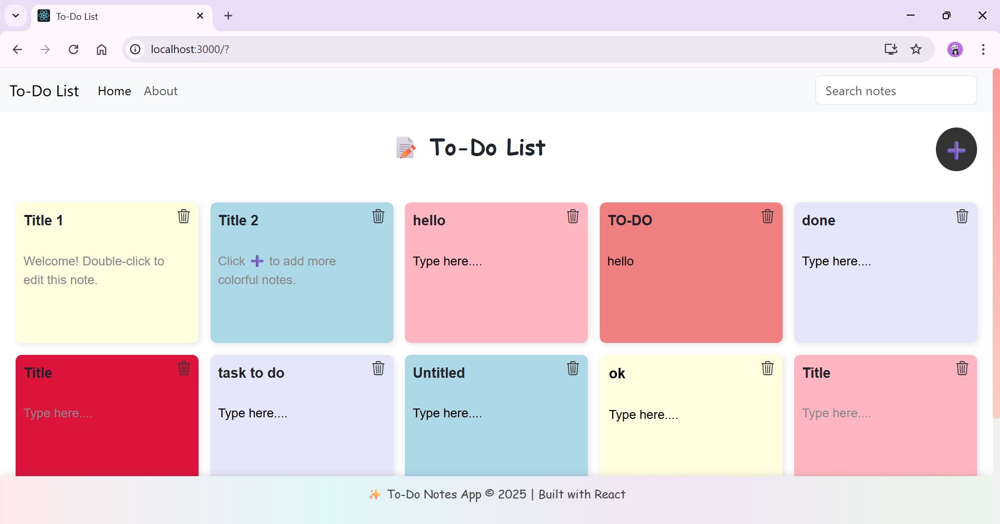
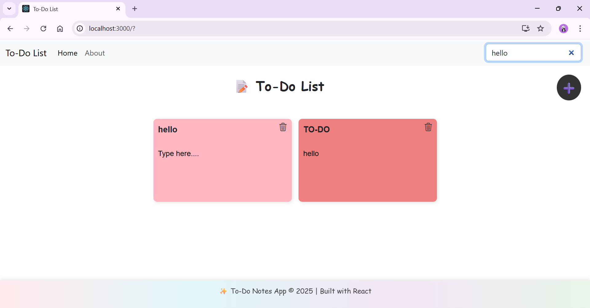

# 🗒️ React To-Do Notes App

A visually appealing sticky-note style **to-do list app** built using **React**.  
Easily create, color, organize, and search your notes — all in one place!

---

## 🎯 Features

- 🎨 **Create colorful notes** using a pastel color palette
- 📝 **Edit note title and content** by clicking or double-clicking directly inside the note
- 🔍 **Live search** functionality for quickly filtering notes by title or body text
- ➕ **Add new notes** using a prominent plus (+) button with color picker
- 🗑️ **Delete notes** with a smooth fade-out animation and trash icon
- ✍️ Notes support multi-line content with proper word wrapping
- 🎯 Cursor automatically jumps to where you last typed
- 📐 Responsive design that works across all screen sizes
- 📦 Clean component structure: Header, Footer, Todos, TodoItem
- 🎯 Planned: Drag and drop with `react-beautiful-dnd` for manual sorting

---

## 🖼️ Screenshots

---

## 🗂️ Folder Structure

src/
├── App.js               // Main application logic
├── App.css             // Styling (pastel themes, layout)
├── index.js            // Entry point
├── My Components/      // Reusable component structure
│   ├── Header.js
│   ├── Footer.js
│   ├── Todos.js
│   └── TodoItem.js
